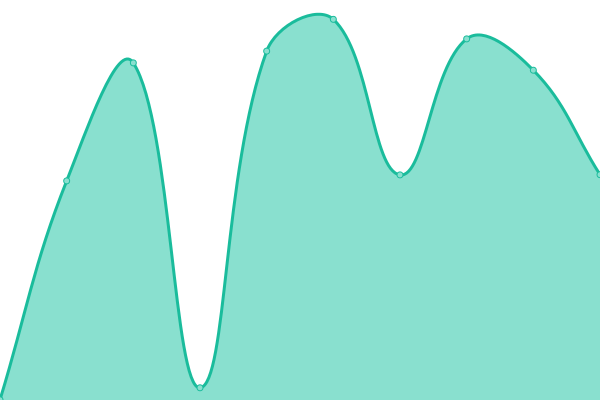
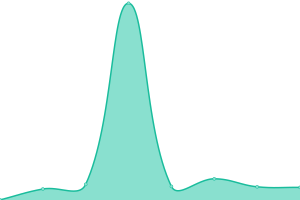

# [📈 Live Status](https://uptime.pandaily.com): <!--live status--> **🟩 All systems operational**

This repository contains the open-source uptime monitor and status page for [Pandaily](https://pandaily.com), powered by [Upptime](https://github.com/upptime/upptime).

With [Upptime](https://upptime.js.org), you can get your own unlimited and free uptime monitor and status page, powered entirely by a GitHub repository. We use [Issues](https://github.com/PandaDaily/upptime/issues) as incident reports, [Actions](https://github.com/PandaDaily/upptime/actions) as uptime monitors, and [Pages](https://uptime.pandaily.com) for the status page.

<!--start: status pages-->
<!-- This summary is generated by Upptime (https://github.com/upptime/upptime) -->
<!-- Do not edit this manually, your changes will be overwritten -->
<!-- prettier-ignore -->
| URL | Status | History | Response Time | Uptime |
| --- | ------ | ------- | ------------- | ------ |
|  [Pandaily](https://pandaily.com) | 🟩 Up | [pandaily.yml](https://github.com/PandaDaily/uptime/commits/HEAD/history/pandaily.yml) | 

 1393ms
     
 | 

<a href="https://uptime.pandaily.com/history/pandaily">87.75%</a>
    

|  [Pandata](https://pandata.pandaily.com) | 🟩 Up | [pandata.yml](https://github.com/PandaDaily/uptime/commits/HEAD/history/pandata.yml) | 

 922ms
     
 | 

<a href="https://uptime.pandaily.com/history/pandata">86.63%</a>
    

|  [Decode China](https://decode.pandaily.com) | 🟩 Up | [decode-china.yml](https://github.com/PandaDaily/uptime/commits/HEAD/history/decode-china.yml) | 

 864ms
     
 | 

<a href="https://uptime.pandaily.com/history/decode-china">88.19%</a>
    

|  [Pandaread](https://pandaread.com) | 🟩 Up | [pandaread.yml](https://github.com/PandaDaily/uptime/commits/HEAD/history/pandaread.yml) | 

 214ms
     
 | 

<a href="https://uptime.pandaily.com/history/pandaread">100.00%</a>
    

<!--end: status pages-->

[**Visit our status website →**](https://uptime.pandaily.com)

## 📄 License

- Powered by: [Upptime](https://github.com/upptime/upptime)
- Code: [MIT](./LICENSE) © [Pandaily](https://pandaily.com)
- Data in the `./history` directory: [Open Database License](https://opendatacommons.org/licenses/odbl/1-0/)
